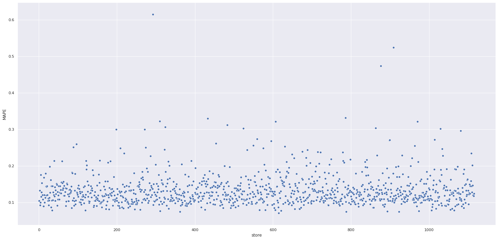
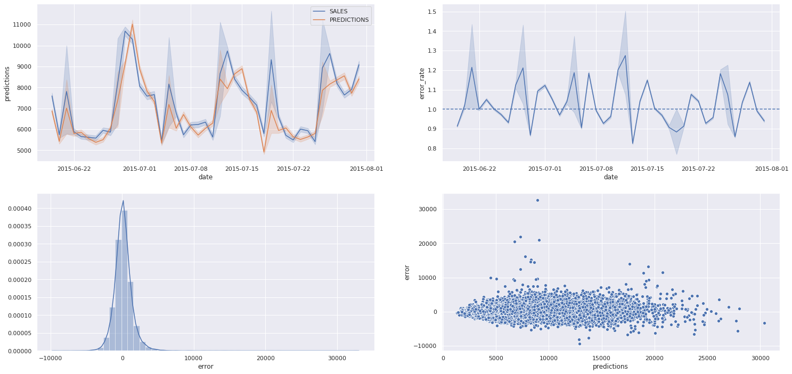
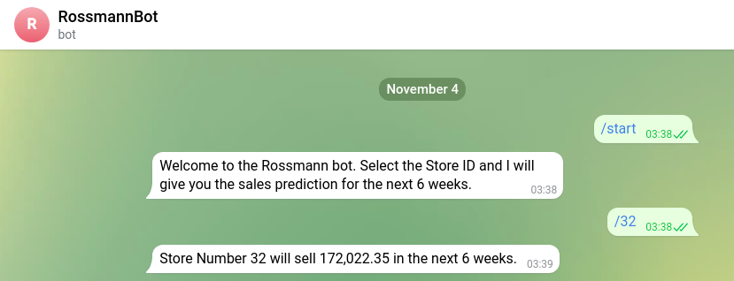

# Rossmann - Previsão de Vendas
Este projeto segue as recomendações do curso **DS em Produção**, na [Comunidade DS](https://www.comunidadedatascience.com/). 
Uma competição foi proposta no site [Kaggle](https://www.kaggle.com/c/rossmann-store-sales/overview/description) em 2015, onde apresentou-se um problema de predição de vendas para a empresa Rossmann.

---
## 1. Business Problem
Rossmann opera mais de 3.000 drogarias em 7 países europeus. Atualmente, os gerentes de loja da Rossmann têm a tarefa de prever suas vendas diárias com até seis semanas de antecedência. As vendas da loja são influenciadas por muitos fatores, incluindo promoções, competição, feriados escolares e estaduais, sazonalidade e localidade. Com milhares de gerentes individuais prevendo vendas com base em suas circunstâncias únicas, a precisão dos resultados pode ser bastante variada. (kaggle.com, tradução livre).

## 2. Assumptions
### 2.1. Attributes Definition
A definição para cada um dos atributos encontra-se abaixo, conforme indicação no problema, apresentado pelo Kaggle: https://www.kaggle.com/c/rossmann-store-sales/data
|              Atributos             |                                  Significado                                            |
|          :-------------:           | :-------------------------------------------------------------------------------------: |
|                id                  |       an Id that represents a (Store, Date) duple within the test set             |
|               Store                |                    a unique Id for each store                |
|               Sales                |    the turnover for any given day (this is what you are predicting)   |
|             Customers              |                      the number of customers on a given day                       |
|                Open                | an indicator for whether the store was open: 0 = closed, 1 = open |
|            StateHoliday            | Medida (em pés quadrado) do espaço interior dos imóveis      |
|          SchoolHoliday             |     Medida (em pés quadrados) quadrada do espaço terrestre   |
|          StoreType                 |                 Número de andares do imóvel                  |
|            Assortment              | Variável que indica a presença ou não de vista para água (0 = não e 1 = sim) |
|       CompetitionDistance          | Um índice de 0 a 4 que indica a qualidade da vista da propriedade. Varia de 0 a 4, onde: 0 = baixa  4 = alta |
| CompetitionOpenSince\[Month/Year\] | Um índice de 1 a 5 que indica a condição do imóvel. Varia de 1 a 5, onde: 1 = baixo \|-\| 5 = alta |
|                Promo               | Promo2 is a continuing and consecutive promotion for some stores: 0 = store is not participating, 1 = store is participating|
|                Promo2              | describes the year and calendar week when the store started participating in Promo2  |
|       Promo2Since\[Year/Week\]     | A metragem quadrada do espaço habitacional interior abaixo do nível do solo |
|            PromoInterval           | describes the consecutive intervals Promo2 is started, naming the months the promotion is started anew.  E.g. "Feb,May,Aug,Nov" means each round starts in February, May, August, November of any given year for that store               |

### 2.2. Business Assumption
- CompetitionDistance       -> Para os casos como NA, foram assumidos que competidores estavam a 200000.0 (muito longe).
- CompetitionOpenSiceMonth  -> Para os casos como NA, foram assumidos como o mês da coluna Date, da respectiva linha.
- CompetitionOpenSiceYear   -> Para os casos como NA, foram assumidos como o ano da coluna Date, da respectiva linha.
- Promo2SinceWeek           -> Para os casos como NA, foram assumidos como a semana correspondente a data da coluna Date, da respectiva linha.
- Promo2SiceYear            -> Para os casos como NA, foram assumidos como o ano da coluna Date, da respectiva linha.
- Apenas os registros que possuem Open = 1 e Sales > 0 serão considerados para preparação do modelo.

## 3. Solution Strategy
**Coleta de Dados:** Coleta dos dados no kaggle, [Rossmann Store Sales - Data](https://www.kaggle.com/c/rossmann-store-sales/data).

**Preparação dos Dados:** 
- Realização de transformações como renomeação de colunas, alteração de tipos de dados, preenchimento de valores NA.
- Além disso, realização de análise estatística descritiva.

**Feature Engineering:**
- Criação do Mindmap de hipóteses.
- Criação de novos atributos, com base no midnmap.
- Filtragem de variáveis

**Análise Exploratória de Dados:** Realização de análises exploratórias Univariada, Bivariada e Multivariada. 

**Modelagem de Dados:** Preparação dos dados para aplicação do modelo.

**Seleção de Features:** Aplicação do algorítmo Boruta para seleção de features.

**Machine Learning:** Escolha de um modelo de machine learning para previsão de vendas através de testes (Os modelos testados são: Avarage Model, Linear Regression Model, Linear Regression Regularized Model - LASSO, Random Forest Regressor e XGBoost Regressor).

**Hyperparameter Fine Tuning:** Aplicação da estratégia de Random Search para seleção de parâmetros.

**Interpretação dos Erros:** Análise e interpretação da performance do modelo aplicado.

**Deploy:** Disponibilizar o acesso às previsões através de um robô, no aplicativo Telegram.

## 4. Top 3 Data Insights
**H1:** Lojas com maior sortimentos deveriam vender mais.

**H2:** Lojas com competidores mais próximos deveriam vender menos.

**H8:** Lojas deveriam vender mais ao longo dos anos.

## 5. Machine Learning Model
XGBoost foi selecionada devido à sua boa performance e baixo uso computacional em comparação a Random Forest.

## 6. Machine Learning Performance
A performance do modelo é medida através da análise do erro das previsões.
* A coluna MAE (Mean Absolute Error) representa a variação média que o modelo apresenta nas previsões.
* Já a coluna MAPE (Mean Absolute Percentage Error), é a representação em percentual do MAE.

|Model Name| MAE |	MAPE |
| ----- | ----------- | --------------- |
|XGB Regressor Tuned |	886.07 |	0.1336 |

---------------------------------------

A maioria das lojas encontram-se na região do MAPE entre 0,015 e 0,25. Essa informação pode ser observada no gráfico abaixo, onde é possível verificar a concentração na região indicada.

Neste gráfico é claramente possível obserar que existem lojas mais desafiadoras que outras.

---------------------------------------

Na figura abaixo, o primeiro gráfico apresenta as previsões das lojas nas próximas 6 semanas. Onde a linha azul representa as vendas reais e as previsões são representadas pela linha laranja.

O segundo gráfico mostra a variação do erro ao longo do tempo, sendo a linha base no valor 1, que indicaria uma previsão perfeita.

No terceiro gráfico, pode-se observar a distribuição dos erros que o modelo gerou.

E por fim, o último gráfico apresenta a relação entre o erro e a previsão que o modelo gerou. Onde é possível observar que quanto maior o valor da previsão, mais disperso fica o erro.

---------------------------------------

## 7. Business Result
O negócio pode verificar o resultado através de uma aplicação no Telegram, que possibilita ao usuário ter acesso às previsões de venda para cada loja.
[Rossmann Bot Telegram](http://t.me/fjj02_rossmann_bot)

1. Clique no link acima e será direcionado ao Telegram;
2. Escreva: '/start'
3. Escolha a loja que deseja ver a previsão nas próximas 6 semanas, enviando o número da loja seguido de uma barra. Assim: '/32'
4. 

---------------------------------------
**TOTAIS:**
* A soma de todas as previsões das lojas nas 6 semanas foi de *$283,551,671.77*.
* Sendo o melhor cenário com valor de *$284,541,502.65*, e o pior, com valor de *$282,561,840.88*.

|    Scenario    |       Values       |
| -------------- | ------------------ |
| predictions    |   $283,551,671.77  |
| worst_scenario |   $282,561,840.88  |
| best_scenario  |   $284,541,502.65  |

## 8. Conclusion

## 9. Next Steps to Improve
